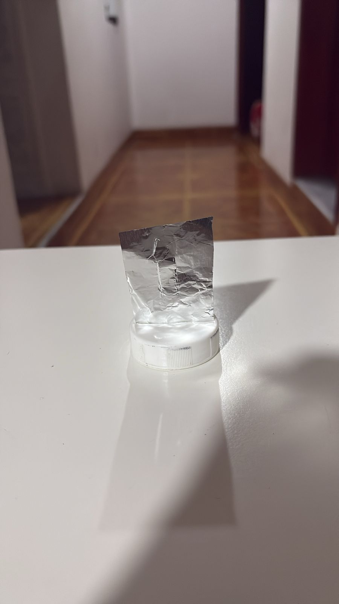

# 🌟 Experimento de la Doble Rendija - Proyecto Educativo


## 📖 Descripción

Este proyecto proporciona una **librería completa de simulación** para el famoso **experimento de la doble rendija de Young**, uno de los experimentos más importantes en la historia de la física cuántica que demuestra la naturaleza ondulatoria de la luz.

### ¿Qué es el Experimento de la Doble Rendija?

El experimento de la doble rendija demuestra uno de los misterios más profundos del mundo cuántico: la **dualidad onda-partícula**. Cuando la luz pasa a través de dos rendijas estrechas y paralelas, crea un patrón de interferencia en una pantalla, mostrando que la luz se comporta como una onda. Este mismo experimento con partículas individuales (fotones, electrones) revela comportamientos aún más misteriosos de la mecánica cuántica.

## ✨ Características

- ✅ **Simulación completa** de patrones de difracción e interferencia
- ✅ **Visualización 1D y 2D** de alta calidad
- ✅ **Predicciones teóricas** detalladas para planificar experimentos
- ✅ **Análisis de datos experimentales** con comparación teoría vs práctica
- ✅ **Cálculo automático** de posiciones de máximos y mínimos
- ✅ **Guía educativa completa** para construcción del experimento físico
- ✅ **Exportación** de resultados y gráficos para reportes
- ✅ **Ejemplos interactivos** listos para usar

## 🚀 Instalación

### Requisitos

- Python 3.7 o superior
- numpy
- matplotlib

### Instalación de dependencias

```bash
pip install numpy matplotlib
```

O si usas conda:

```bash
conda install numpy matplotlib
```

## 📁 Estructura del Proyecto

```
Proyecto/
│
├── doble_rendija_mejorado.py    # Librería principal
├── ejemplos_uso.py               # Ejemplos prácticos interactivos
├── README.md                     # Este archivo
└── (archivos generados)          # Gráficos y datos exportados
```

## 🎯 Uso Rápido

### Ejemplo Básico

```python
from doble_rendija_mejorado import ExperimentoDobleRendija, graficar_patron

# Crear experimento con láser rojo
exp = ExperimentoDobleRendija(
    longitud_onda=632e-9,      # 632 nm (láser rojo)
    ancho_rendija=100e-6,      # 100 μm
    separacion=400e-6,         # 400 μm
    distancia_pantalla=2.0     # 2 metros
)

# Simular y visualizar
y, intensidad = exp.simular(doble=True)
graficar_patron(y, intensidad, titulo="Mi Experimento")
```

### Ver Predicciones

```python
# Obtener predicciones teóricas para tu experimento
exp.imprimir_predicciones()
```

Esto mostrará:
- Separación esperada entre franjas
- Posiciones de los máximos
- Número de franjas visibles
- Consejos de medición

### Menú Interactivo

Para un uso más fácil, ejecuta el archivo de ejemplos:

```bash
python ejemplos_uso.py
```

Esto abrirá un menú interactivo con opciones para:
1. Ver predicciones para tu experimento
2. Generar gráficos para reportes
3. Analizar datos experimentales
4. Calcular parámetros desde mediciones
5. Exportar todo automáticamente

## 🔬 Guía para el Experimento Físico

### Materiales Necesarios

- 🔴 Puntero láser rojo (5mW, ~632 nm)
- 🔳 Papel aluminio (buena calidad)
- 🔪 Cuchilla de precisión o bisturí
- 📏 Regla metálica
- 📋 Pantalla blanca (cartulina o pared)
- 📷 Cámara para documentar
- 🎬 Trípode (recomendado)

### Pasos de Construcción

1. **Preparar el soporte**: Corta cartón paja de 15x15 cm con un marco central (en nuestro caso usamos un soporte circular)
2. **Montar el aluminio**: Pega papel aluminio bien estirado sobre el marco
3. **Crear las rendijas**: Con cuchilla y regla, haz dos cortes paralelos:
   - Ancho: ~0.1-0.2 mm
   - Separación: ~0.3-0.5 mm
   - Longitud: ~2 cm
4. **Montar el experimento**:
   - Láser a 10-20 cm de las rendijas
   - Pantalla a 1-3 metros de las rendijas
   - Todo alineado en línea recta
5. **Observar**: En un cuarto oscuro, deberías ver múltiples franjas verticales

### ⚠️ Seguridad

- 🚫 **NUNCA** mires directamente al haz del láser
- 🚫 **NUNCA** apuntes el láser a personas o animales
- ✅ Usa gafas de seguridad si es posible
- ✅ Ten cuidado al usar la cuchilla

## 📊 Análisis de Resultados

### Comparar con Teoría

```python
from doble_rendija_mejorado import comparar_experimento_teoria
import numpy as np

# Cargar tus datos experimentales
y_medido = np.loadtxt('posiciones.txt')        # en metros
intensidad_medida = np.loadtxt('intensidad.txt')  # normalizada 0-1

# Comparar
stats = comparar_experimento_teoria(
    y_medido, 
    intensidad_medida, 
    exp,
    guardar="comparacion_mi_experimento.png"
)

print(f"Correlación: {stats['correlacion']:.4f}")
```

### Calcular Parámetros Desde Mediciones

Si mediste la separación entre franjas:

```python
# Tus mediciones
separacion_franjas = 2.5e-3  # 2.5 mm en metros
distancia_pantalla = 2.0     # 2 metros
longitud_onda = 632e-9       # 632 nm

# Calcular separación entre rendijas
separacion_rendijas = (longitud_onda * distancia_pantalla) / separacion_franjas

print(f"Separación entre rendijas: {separacion_rendijas*1e6:.1f} μm")
```

## 📈 Ejemplos Avanzados

### Efecto del Color del Láser

```python
import matplotlib.pyplot as plt

colores = {
    'Rojo': 632e-9,
    'Verde': 532e-9,
    'Azul': 450e-9
}

plt.figure(figsize=(12, 6))
for nombre, longitud in colores.items():
    exp = ExperimentoDobleRendija(longitud_onda=longitud)
    y, I = exp.simular()
    plt.plot(y*1000, I, label=f'{nombre} ({longitud*1e9:.0f} nm)')

plt.xlabel('Posición (mm)')
plt.ylabel('Intensidad')
plt.title('Efecto de la Longitud de Onda')
plt.legend()
plt.grid(True, alpha=0.3)
plt.show()
```

### Animación de Parámetros

```python
# Variar separación de rendijas dinámicamente
for separacion in np.linspace(200e-6, 600e-6, 10):
    exp = ExperimentoDobleRendija(separacion=separacion)
    y, I = exp.simular()
    plt.clf()
    plt.plot(y*1000, I)
    plt.title(f'Separación: {separacion*1e6:.0f} μm')
    plt.pause(0.3)
```

## 📚 Documentación de la API

### Clase `ExperimentoDobleRendija`

**Constructor:**
```python
ExperimentoDobleRendija(
    longitud_onda=632e-9,        # metros
    ancho_rendija=50e-6,         # metros
    separacion=200e-6,           # metros
    distancia_pantalla=1.0       # metros
)
```

**Métodos principales:**

- `simular(ancho=0.01, puntos=2000, doble=True)` → Tupla[array, array]
  - Ejecuta la simulación y retorna (posiciones, intensidad)

- `calcular_posiciones_franjas(n_max=10)` → ResultadosAnalisis
  - Calcula posiciones teóricas de máximos y mínimos

- `imprimir_predicciones()` → None
  - Imprime predicciones detalladas para el experimento

### Funciones Útiles

- `graficar_patron(y, intensidad, titulo, guardar, mostrar_predicciones, experimento)`
  - Genera visualizaciones 1D y 2D del patrón

- `comparar_experimento_teoria(y_exp, I_exp, experimento, guardar)`
  - Compara resultados experimentales con teoría

- `guia_proyecto_completa()`
  - Retorna guía educativa completa en texto

## 🎓 Experimento en casa

NOTA: Revisar nuevamente la seccion "Guía para el Experimento Físico"

Estos fueron los resultados del experimento realizado en casa

Montaje:



Resultado:


### Secciones Recomendadas

1. **Introducción**
   - Historia del experimento
   - Importancia en física cuántica

2. **Marco Teórico**
   - Ecuaciones de difracción e interferencia
   - Predicciones teóricas (usa `exp.imprimir_predicciones()`)

3. **Metodología**
   - Descripción del montaje (incluye fotos)
   - Parámetros del experimento

4. **Resultados**
   - Fotos del patrón de interferencia
   - Simulaciones (usa los ejemplos)
   - Comparación teoría vs experimento

5. **Discusión**
   - Análisis de resultados
   - Fuentes de error
   - Mejoras posibles

6. **Conclusiones**
   - Qué demuestra el experimento
   - Implicaciones cuánticas

### Generar Todos los Gráficos

```python
from ejemplos_uso import ejemplo_5_exportar_todo

# Genera automáticamente todos los archivos necesarios
ejemplo_5_exportar_todo()
```

Esto crea:
- `predicciones_teoricas.txt` - Predicciones en texto
- `datos_simulacion.csv` - Datos numéricos
- `grafico_principal.png` - Gráfico principal
- `comparacion_simple_doble.png` - Comparación

## 🤝 Créditos y Referencias

### Recursos Educativos

- 📹 [Tutorial de construcción](https://www.instructables.com/id/How-To-Make-a-Simple-Double-Slit/)
- 📹 [Video: Interferencia rendija simple](https://www.youtube.com/watch?v=uohd0TtqOaw)
- 📹 [Video: Interferencia doble rendija](https://www.youtube.com/watch?v=PVyJFzx7zig)
- 📹 [Video: Interferencia de partículas](https://www.youtube.com/watch?v=1LVkQfCptEs)

### Base Teórica

Las ecuaciones implementadas se basan en:
- Difracción de Fraunhofer (rendija simple)
- Interferencia de Young (doble rendija)
- Aproximación de ángulos pequeños

**Ecuaciones clave:**

Rendija simple:
```
I(θ) = I₀ [sin(β)/β]²
donde β = (π·a·sin(θ))/λ
```

Doble rendija:
```
I(θ) = I₀ [sin(β)/β]² · cos²(δ)
donde δ = (π·d·sin(θ))/λ
```

## 📝 Licencia

Este proyecto es de código abierto y está disponible bajo la licencia MIT.

## 💬 Soporte

Si tienes preguntas o encuentras problemas:

1. Revisa la guía completa: `print(guia_proyecto_completa())`
2. Ejecuta los ejemplos interactivos: `python ejemplos_uso.py`
3. Consulta la documentación en los archivos fuente

## 🌟 Consejos Finales

### Para Obtener Mejores Resultados:

1. **Construcción cuidadosa**: Las rendijas deben ser lo más rectas y paralelas posible
2. **Cuarto oscuro**: Reduce la luz ambiental al máximo
3. **Estabilidad**: Usa trípodes o soportes fijos para evitar vibraciones
4. **Múltiples mediciones**: Toma varias medidas y promédialas
5. **Documentación completa**: Fotografía cada paso del proceso
6. **Paciencia**: Puede tomar varios intentos obtener un patrón claro

### Criterios de Éxito:

✅ Se observan al menos 5 franjas claras
✅ Las franjas son rectas y uniformes  
✅ El patrón es simétrico  
✅ Puedes medir la separación entre franjas  
✅ Tus mediciones están dentro del 10-20% de la teoría  

---

## 🚀 ¡Comienza Ahora!

```bash
# 1. Ejecuta la demostración completa
python doble_rendija_mejorado.py

# 2. O usa el menú interactivo
python ejemplos_uso.py

# 3. Consulta las predicciones antes de tu experimento
```

**¡Éxito con tu proyecto! Estás a punto de replicar uno de los experimentos más fascinantes de la física! 🔬✨**

---

*Este proyecto fue creado con fines educativos para demostrar los principios fundamentales de la mecánica cuántica y la naturaleza ondulatoria de la luz.*
